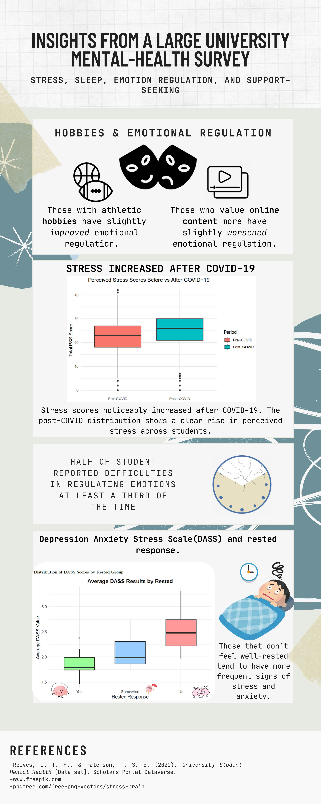

# Student Mental Health Analysis: Stress, Sleep, Emotion Regulation, and Support-Seeking

A comprehensive data analysis project examining the mental health and wellbeing of Canadian undergraduate students during the COVID-19 pandemic. This project investigates relationships between academic programs, emotional regulation, social support seeking, sleep quality, and perceived stress levels.

## 📊 Visual Summary



*Visual summary of key findings from the student mental health analysis*

## 🔬 Statistical Methods & Principles Demonstrated

This project showcases expertise in the following statistical principles and methods:

### Hypothesis Testing & Statistical Inference
- **One-way ANOVA**: Testing differences in means across multiple groups (academic programs, restfulness categories)
- **Independent t-tests**: Comparing means between two independent groups (sex differences, international status)
- **Paired t-tests**: Analyzing within-subject changes (pre/post COVID-19 stress levels)
- **Statistical significance testing**: Interpreting p-values, alpha levels (α = 0.05), and making inferential decisions

### Effect Size & Practical Significance
- **Cohen's d**: Calculating and interpreting effect sizes for practical significance
- **Effect size interpretation**: Distinguishing between statistical and practical significance
- Distinguishing small, medium, and large effect sizes

### Correlation & Association Analysis
- **Pearson correlation**: Examining relationships between continuous variables
- **Correlation matrix analysis**: Identifying significant associations among multiple variables
- **Interpretation of correlation coefficients**: Understanding strength and direction of relationships

### Linear Modeling & Regression
- **Linear regression models**: Modeling relationships between predictors and outcomes
- **Model assessment**: Evaluating model fit and significance

### Data Analysis & Statistical Software
- **R programming**: Data manipulation, statistical analysis, and visualization
- **Data cleaning and preprocessing**: Handling missing data, recoding variables, data transformation
- **Statistical packages**: `psych`, `effectsize`, `tidyverse`, `ggplot2`

### Research Design & Analysis
- **Between-subjects design**: Comparing groups (academic programs, demographic factors)
- **Within-subjects design**: Pre/post comparisons (COVID-19 stress impact)
- **Survey data analysis**: Working with validated psychological scales and survey responses
- **Sample size considerations**: Analyzing large samples (n = 1,192) with appropriate statistical power

### Data Visualization & Reporting
- **Statistical graphics**: Creating informative visualizations (boxplots, scatter plots, regression lines)
- **Results interpretation**: Communicating statistical findings in accessible language
- **Technical documentation**: Documenting methodology, assumptions, and limitations

## 📋 Project Overview

This project analyzes survey data from **1,192 undergraduate students** across Canada, collected between September 22 and October 30, 2020. The study was conducted during a critical period of the COVID-19 pandemic, providing insights into how external stressors and individual factors influence student mental health.

### Key Research Questions

1. **Program of Study and Emotional Regulation**: Do students in different academic programs experience different levels of emotional regulation difficulties?
2. **Program of Study and Social Support**: Do students in different programs differ in how much social support they seek?
3. **Sleep Quality and Mental Health**: Is feeling well-rested associated with differences in mental health symptoms?
4. **COVID-19 Impact on Stress**: Did students' perceived stress levels change significantly from before to after the COVID-19 outbreak?
5. **Hobbies and Emotional Regulation**: Is there a relationship between students' emotional-regulation difficulties and their hobby patterns?

## 🔍 Key Findings

### Main Results

- **Program Differences**: Minimal or non-significant differences were found across academic programs for both emotional-regulation difficulties (DERS) and social-support seeking (SSS), suggesting that program of study alone does not strongly predict these mental health factors.

- **Sleep and Mental Health**: A **highly significant** relationship was found between feeling well-rested and lower depression, anxiety, and stress (DASS-21) scores. Students who reported feeling well-rested showed noticeably better mental health outcomes.

- **COVID-19 Stress Impact**: Students experienced a **statistically significant increase** in perceived stress after the COVID-19 outbreak (p < 0.001), with a medium effect size (Cohen's d ≈ 0.44), indicating a meaningful and practical increase in stress levels.

- **Hobbies and Emotional Regulation**: Some hobby variables showed small but statistically significant correlations with emotional-regulation difficulties, though the overall relationships were modest.

### Implications

These findings suggest that **individual wellbeing factors** (such as sleep quality) and **external stressors** (such as the COVID-19 pandemic) may exert stronger influences on student mental health than academic program alone. This has important implications for university mental health support services and intervention strategies.

## 📊 Dataset Description

### Data Collection

- **Sample Size**: 1,192 undergraduate students
- **Collection Period**: September 22 - October 30, 2020
- **Recruitment**: Online via Facebook university groups, Reddit, Instagram, Twitter, and research-participant portals (REACH BC, CPA R2P2)
- **Survey Platform**: Qualtrics
- **Total Variables**: 147 variables

### Key Variables

The dataset includes validated psychological scales, behavioral measures, and demographic information:

- **DERS-16** (Difficulties in Emotional Regulation Scale): 16 items measuring emotional regulation difficulties
- **SSS** (Seeking Social Support scale): 12 items measuring social support seeking behaviors
- **DASS-21** (Depression Anxiety Stress Scale): 21 items measuring depression, anxiety, and stress symptoms
- **PSS** (Perceived Stress Scale): 10 items measuring perceived stress (collected pre- and post-COVID-19)
- **Demographics**: Age, ethnicity, sex, gender, program of study, year, employment status, living situation, etc.
- **Behavioral Measures**: Sleep patterns, exercise, hobbies, mindfulness practices

### Data Files

- `data/student_mental_health.csv`: Main dataset with all survey responses
- `data/PSS_pre_post_totals.csv`: Pre- and post-COVID-19 Perceived Stress Scale totals

## 🛠️ Technical Details

### Methodology

#### Statistical Analyses

1. **ANOVA Tests**: Used to compare emotional regulation (DERS) and social support seeking (SSS) across different academic programs
2. **t-Tests**: Compared social support seeking by sex and international status
3. **Paired t-Test**: Analyzed changes in perceived stress from pre- to post-COVID-19
4. **Correlation Analysis**: Examined relationships between hobbies and emotional regulation difficulties
5. **Effect Size Calculations**: Cohen's d and other effect size measures to assess practical significance

#### Data Processing

- **Scoring Procedures**: All psychological scales were scored according to their validated procedures:
  - DERS-16: Items summed or averaged
  - SSS: Items averaged
  - DASS-21: Items summed and doubled for subscale totals
  - PSS: Items summed with reverse-scoring for items 4, 5, 7, and 8
- **Data Cleaning**: Listwise deletion for missing data in analyses
- **Recoding**: Program of study recoded from numeric codes (1-8) to descriptive labels
- **Factor Treatment**: Restfulness treated as an ordered factor (Yes, Somewhat, No)

### Technologies & Tools

- **Programming Language**: R
- **Key R Packages**:
  - `tidyverse`: Data manipulation and visualization
  - `ggplot2`: Statistical graphics
  - `psych`: Psychological research tools
  - `effectsize`: Effect size calculations
  - `knitr`: Dynamic report generation
  - `dplyr`, `tidyr`: Data wrangling
  - `readxl`, `writexl`: Excel file handling

### Project Structure

```
data_analysis_student_mental_health/
├── data/
│   ├── student_mental_health.csv      # Main survey dataset
│   └── PSS_pre_post_totals.csv        # Pre/post stress totals
├── final_analysis_report.pdf          # Complete analysis report
├── final_Infographic.pdf               # Visual summary infographic
└── intermediate_work/                  # Development files
    ├── final_analysis/                 # Final analysis R markdown files
    └── [additional working files]
```

## 📈 Results Summary

### Statistical Significance

- **Program vs. DERS**: Small but statistically significant differences (ANOVA, α = 0.05)
- **Program vs. SSS**: No significant differences (p-value large)
- **Restfulness vs. DASS**: Highly significant differences (F-statistic, p < 0.001)
- **Pre vs. Post COVID-19 PSS**: Highly significant increase (paired t-test, p < 0.001, Cohen's d ≈ 0.44)

### Effect Sizes

- **COVID-19 Stress Increase**: Medium effect size (Cohen's d ≈ 0.44), indicating a meaningful practical increase
- **Hobbies-DERS Relationships**: Small but statistically significant correlations detected

## 📚 References & Scales

This project uses several validated psychological assessment scales:

- **DERS-16**: Difficulties in Emotional Regulation Scale (16-item version)
- **SSS**: Seeking Social Support scale
- **DASS-21**: Depression Anxiety Stress Scale (21-item version)
- **PSS**: Perceived Stress Scale (10-item version)

All scoring procedures followed official scale documentation and validation studies.

## 👥 Contributors

This project was completed by:
- Andy Chen
- Krzysztof Oleksiak
- Rafael Serrano Aparicio
- Jeffrey Yan Man Fong
- Danny Han

## 📄 License & Usage

This project is for educational and research purposes. The dataset and analysis are intended to contribute to understanding student mental health, particularly during periods of significant external stress such as the COVID-19 pandemic.

## 🔗 Additional Resources

- **Final Analysis Report**: See `final_analysis_report.pdf` for the complete statistical analysis and detailed findings
- **Infographic**: See `final_Infographic.pdf` for a visual summary of key results
- **Working Files**: Intermediate analysis files are available in the `intermediate_work/` directory

---

*This analysis provides valuable insights into student mental health during the COVID-19 pandemic and highlights the importance of sleep quality and external stressors in understanding student wellbeing.*
